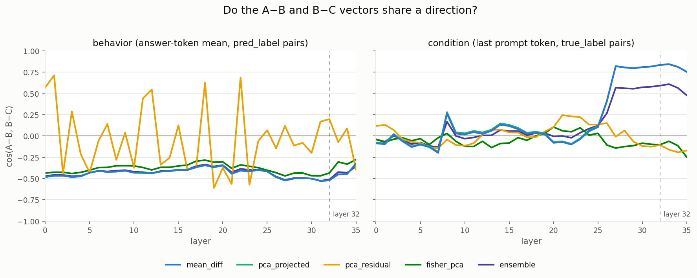

# VLM Privacy Steering

**Label Distribution**
vlm-privacy-steering/outputs/02_formal_full1200/00_base/base_qwen_vl_train_717.csv

|label| true label  | pred label |
|-----|-------------|------------|
|  A  | 290 (40.4%) | 248 (34.6%)|
|  B  | 144 (20.1%) | 462 (64.4%)|
|  C  | 283 (39.5%) | 7 (1.0%)   |

## Extract condition and behavior vectors

Extract condition vector:
`CUDA_VISIBLE_DEVICES=6 python src/main_condition.py`

Extract behavior vector:
`CUDA_VISIBLE_DEVICES=6 python src/main_behavior.py --grouping label_pair`

### Do A−B and B−C Vectors Share a Direction? 
> Pairwise Vector Geometry (cos A-B vs B-C)

Run `python  src/vector_analysis.py`

Model: `Qwen/Qwen2.5-VL-3B-Instruct` (layers=36, hidden=2048)

  

- Behavior vector 的 mean_diff/ensemble/fisher_pca 全层稳定在 −0.5 附近(A/B/C 答案簇呈等边三角形
- Condition vector 在 26 层处蓝线(mean_diff)从 0 附近跳到 +0.8 并保持到最后(深层出现共享的"敏感度有序轴")