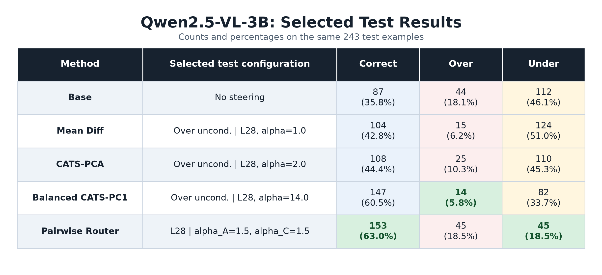
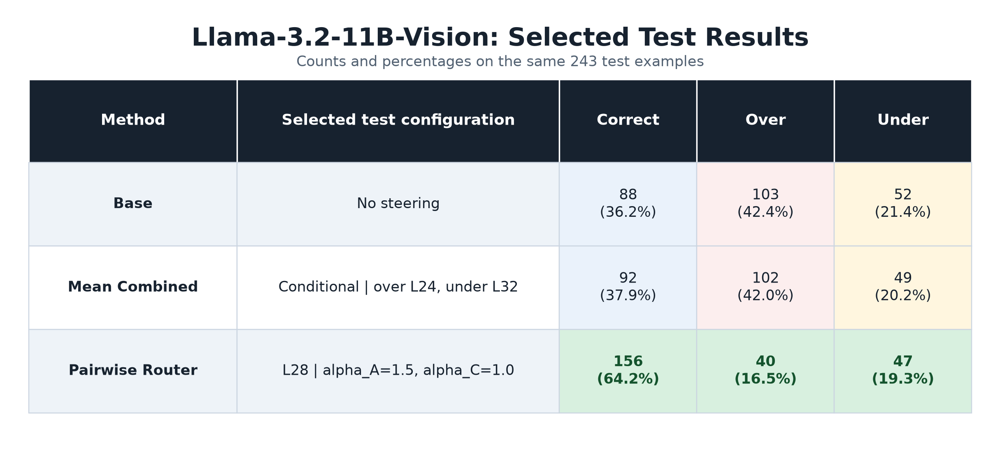

# VLM Privacy Steering - Method 11

This note summarizes the current **Method 11: Pairwise Boundary Router**
experiment. The goal is still to choose the right disclosure granularity for
each image:

| Label | Meaning |
|---|---|
| A | Refuse or avoid identifying the location |
| B | Provide only a broad location, such as country or city |
| C | Provide the exact location |

Earlier steering methods used a single over/under direction. Method 11 instead
models the task as two adjacent boundaries:

```text
A/B boundary: A minus B
B/C boundary: B minus C
```

The intuition is that A, B, and C may not lie on one perfectly shared axis. A
local pairwise direction can be more appropriate than forcing every correction
through one global privacy/utility vector.

## What Method 11 Does

Method 11 has two parts:

1. **Pairwise boundary vectors**

   From train activations, it extracts two local behavior directions:

   ```text
   v_AB = direction from B toward A
   v_BC = direction from C toward B
   ```

   These are learned from pairwise A-vs-B and B-vs-C comparisons rather than
   one all-class mean direction.

2. **Ordinal router**

   At inference time, the model first computes a prompt-token condition score.
   A router threshold maps each sample to a target disclosure level:

   ```text
   high score  -> target A
   middle      -> target B
   low score   -> target C
   ```

   Then the router applies the local behavior vector for that target:

   ```text
   target A -> + alpha_A * v_AB
   target B -> no steering
   target C -> - alpha_C * v_BC
   ```

   In the selected test setting below, the router effectively chooses A or C
   for almost all samples. This improves overall accuracy strongly, but it also
   means Method 11 currently does poorly on true-B examples.

## Selected Test Setting

Both selected runs use layer 28 and the bisector router axis.

| Model | Selected setting | Test n | Correct | Over | Under |
|---|---|---:|---:|---:|---:|
| Qwen2.5-VL-3B | L28, alpha_A=1.5, alpha_C=1.5 | 243 | 153 | 45 | 45 |
| Llama-3.2-11B-Vision | L28, alpha_A=1.5, alpha_C=1.0 | 243 | 156 | 40 | 47 |

For comparison, the base results were:

| Model | Correct | Over | Under |
|---|---:|---:|---:|
| Qwen2.5-VL-3B base | 87 | 44 | 112 |
| Llama-3.2-11B-Vision base | 88 | 103 | 52 |

Method 11 gives the best overall correctness among the selected results:

- Qwen: `153 / 243 = 62.96%`
- Llama: `156 / 243 = 64.20%`

The main caveat is the middle class. On the test set there are 49 true-B
examples. Method 11 correctly predicts only 1 B for Qwen and 3 B for Llama,
because the current router sends nearly everything to A or C:

| Model | Route A | Route B | Route C | Correct B |
|---|---:|---:|---:|---:|
| Qwen2.5-VL-3B | 119 | 0 | 124 | 1 / 49 |
| Llama-3.2-11B-Vision | 119 | 0 | 124 | 3 / 49 |

So the current result is best read as:

> Method 11 is very effective at separating A vs C and improving total
> accuracy, but the router still needs a better way to preserve the broad
> middle category B.

## Selected Test Results

### Qwen2.5-VL-3B



### Llama-3.2-11B-Vision



