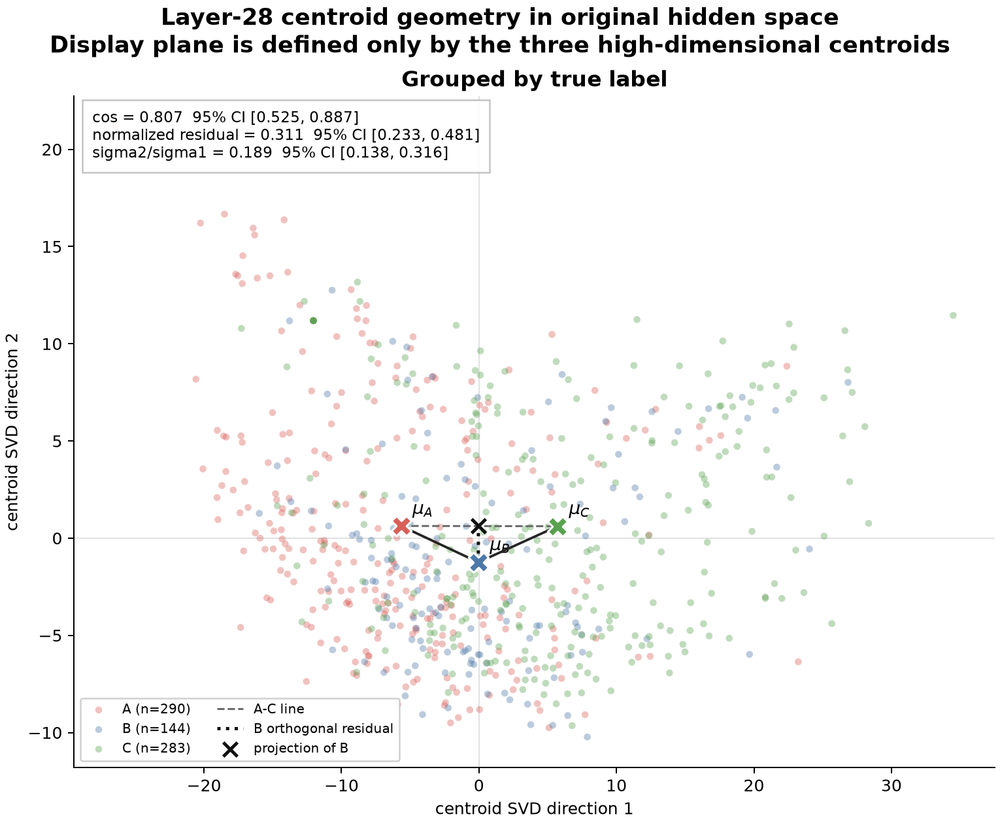
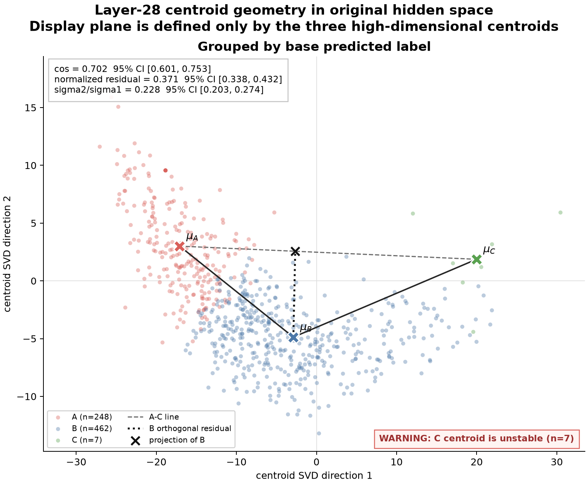
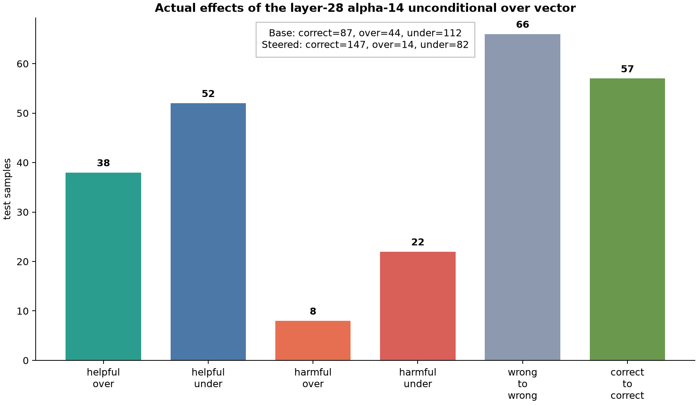
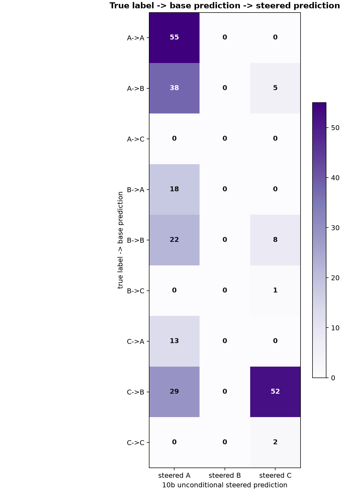
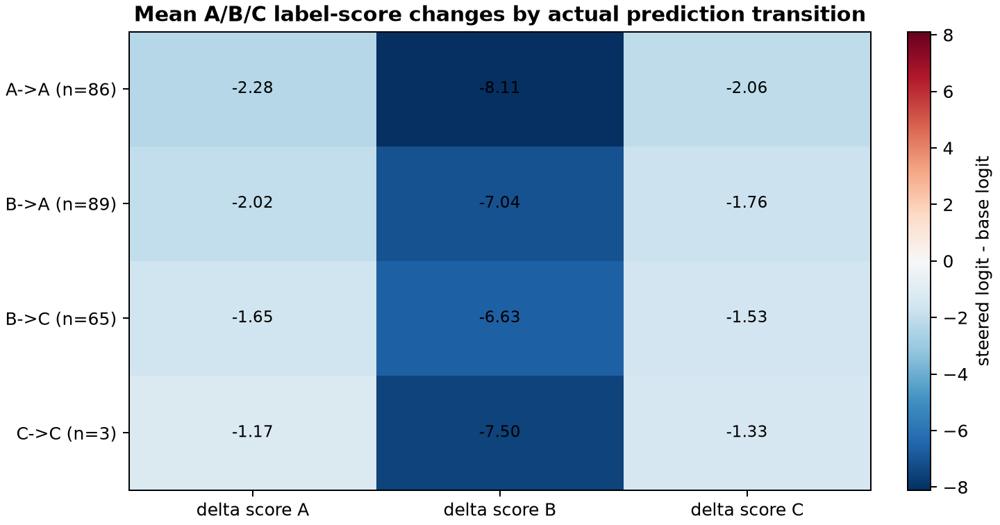
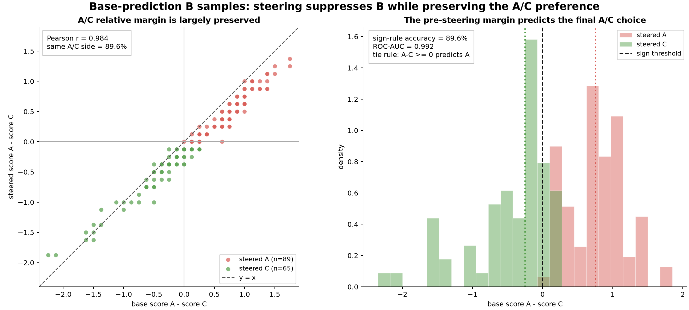

# VLM Privacy Steering - Jul 14

## 1. A、B、C 是否近似共线？

### 1.1 分析方法

对每个未 steering 的 base sample，取 layer 28 的 last-prompt-token hidden state：

```text
h_i in R^2048
```

然后分别进行两套独立分析：

- 按 true label 分组：true A / true B / true C
- 按 base predicted label 分组：pred A / pred B / pred C

在原始 2048 维空间中计算三个类别中心：

```text
mu_A, mu_B, mu_C
```

主要检验以下指标：

```text
direction cosine = cosine(mu_B - mu_A, mu_C - mu_B)
```

如果 A→B→C 沿同一条直线、同一方向排列，该 cosine 应接近 `+1`。

同时将 `mu_B` 投影到 A-C 直线上，计算正交残差：

```text
normalized residual =
    distance(mu_B, line(mu_A, mu_C))
    / mean(d_AB, d_BC)
```

最后，对中心化后的 `3×2048` centroid matrix 做 SVD，报告 `sigma2/sigma1`。如果该比值接近 0，三个中心近似一维；如果第二奇异值不可忽略，则单一方向不足以完整描述三个中心。

所有指标都直接在原始 2048 维空间中计算，并使用 1000 次 bootstrap 得到 95% confidence interval。下面的二维图只是在“由三个高维 centroid 张成的二维平面”中展示数据，不是先 PCA 再计算指标，也没有人为强制三个点形成三角形。

### 1.2 按 true label 分组



样本数为：

```text
true A: 290
true B: 144
true C: 283
```

高维指标为：

| Metric | Estimate | Bootstrap 95% CI |
|---|---:|---:|
| direction cosine | 0.807 | [0.525, 0.887] |
| normalized residual | 0.311 | [0.233, 0.481] |
| sigma2/sigma1 | 0.189 | [0.138, 0.316] |

`mu_B` 在 A-C 方向上的 projection parameter 为 `t=0.494`，因此 B 的确大致位于 A 和 C 之间。三个中心存在明显的 A→B→C 顺序趋势，第一维也占主导。

但是，这并不是严格的一维排列：方向 cosine 明显低于 1，B 到 A-C 直线的残差约为相邻 centroid 距离的 31%，而且 `sigma2/sigma1` 的 confidence interval 并不接近 0。

因此，更准确的结论是：

> True-label centroids show a dominant ordered A→B→C trend, but they are not well described as perfectly collinear.

### 1.3 按 base predicted label 分组



样本数为：

```text
pred A: 248
pred B: 462
pred C: 7
```

高维指标为：

| Metric | Estimate | Bootstrap 95% CI |
|---|---:|---:|
| direction cosine | 0.702 | [0.601, 0.753] |
| normalized residual | 0.371 | [0.338, 0.432] |
| sigma2/sigma1 | 0.228 | [0.203, 0.274] |

这里 `t=0.389`，所以 predicted B 仍然大致位于 predicted A 和 predicted C 之间，但偏离一维直线的程度比 true-label grouping 更明显：方向 cosine 更低，normalized residual 上升到 37%，第二奇异值约为第一奇异值的 23%。

但是，base model 只预测了 7 个 C，因此 `mu_C` 的估计不稳定。图中 C centroid 的位置和 bootstrap interval 都必须谨慎解释，不能根据这 7 个点声称模型内部存在一个稳定的“大 C region”。

作为补充验证，我们在 train hidden states 上学习一维 ordinal model 和 supervised rank-2 classifier，并在 test set 上预测 base model 的 A/B/C label：

| Model | Accuracy | Balanced accuracy | Macro F1 |
|---|---:|---:|---:|
| 1D ordinal | 0.922 | 0.943 | 0.776 |
| Supervised rank-2 | 0.984 | 0.990 | 0.942 |
| High-dimensional linear | 0.984 | 0.990 | 0.942 |

监督二维模型明显优于一维 ordinal model，并达到高维 linear probe 的表现。结合 centroid geometry，可以表述为：

> The predicted A/B/C representations are not well explained by a single ordered axis.

这并不等于“模型内部有一个三角形”。当前证据只说明单一有序方向会遗漏可线性解码的第二维信息。

---

## 2. 为什么同一个 over behavior vector 会同时降低 over 和 under？（10b）

这一部分使用完全相同的 243 个 test samples，并通过 `sample_id` 对齐：

- true label
- base prediction
- unconditional steered prediction
- base/steered hidden states
- base/steered A/B/C first-token logits

三个数据源中的 sample ID 都唯一且集合完全一致。逐样本结果严格复现：

```text
Base:                correct=87,  over=44, under=112
10b unconditional:  correct=147, over=14, under=82
```

### 2.1 同一个 vector 同时修复两类错误



根据每个样本 steering 前后的真实状态，可以得到：

| Effect group | Count | Definition |
|---|---:|---|
| helpful over | 38 | base over → steered correct |
| helpful under | 52 | base under → steered correct |
| harmful over | 8 | base correct → steered over |
| harmful under | 22 | base correct → steered under |
| wrong to wrong | 66 | steering 前后都错误 |
| correct to correct | 57 | steering 前后都正确 |

因此，同一个 unconditional over behavior vector 不仅修复了 38 个 over-disclosure，还修复了 52 个 under-disclosure。这不是 conditional router 分别选择两个 vector 的结果，而是同一个 layer-28 intervention 在不同样本上产生了不同输出。

### 2.2 变化几乎全部发生在 base prediction B



从逐样本 transition 可以看到：

```text
base A: 86 samples → 全部保持 A
base C:  3 samples → 全部保持 C
base B: 154 samples → 89 变成 A，65 变成 C
```

其中最关键的两组是：

```text
true A / base B: 38 → A   (helpful over)
true C / base B: 52 → C   (helpful under)
```

如果这个 over vector 只是把所有样本推向更保守的方向，那么 base B 应主要变成 A，不应该有大量样本变成 C。实际结果却是 B 同时分裂到 A 和 C，因此“统一沿 A 方向移动”的解释不成立。

### 2.3 Behavior vector 的主要输出作用是压低 B



这张图比较不同真实 prediction transition 下，steering 前后 A/B/C first-token logits 的平均变化。

虽然三个 absolute logits 都有所下降，但 B score 的下降远大于 A 和 C：

```text
delta score_B: approximately -6.6 to -8.1
delta score_A: approximately -1.2 to -2.3
delta score_C: approximately -1.3 to -2.1
```

分类取决于 label score 之间的相对大小，而不是 absolute logit。因此，这个 intervention 的主要效果可以理解为：

> It removes B as the dominant competitor, rather than directly forcing every sample toward A.

一旦原来稍微占优的 B 被大幅压低，最终输出是 A 还是 C，就取决于该样本在 steering 前已经存在的 A-vs-C preference。

### 2.4 Steering 前的 A/C preference 决定 steering 后的终点

下面只分析 154 个 `base prediction=B` 的样本，并定义：

```text
A/C margin = score_A - score_C
```



结果为：

```text
corr(A/C margin_base, A/C margin_steered) = 0.984
```

也就是说，steering 前后 A 与 C 的相对 preference 高度保持。仅使用 steering 前 `score_A-score_C` 的符号，就能预测 steering 后输出 A 还是 C：

```text
sign-rule accuracy = 138/154 = 89.6%
ROC-AUC = 0.992
```

这里使用 `score_A-score_C >= 0 → A`，因为保存的 bfloat16 logits 中存在少量精确 tie，而 `argmax` 在 A/C tie 时选择顺序靠前的 A。

还有一个小但真实的偏移：steering 后 A/C margin 平均变化为 `-0.200`，即整体略微向 C 偏移。因此不能说 A/C margin 完全不变；更准确的说法是，它高度保留了原有排序，同时发生了轻微 C-direction shift。

